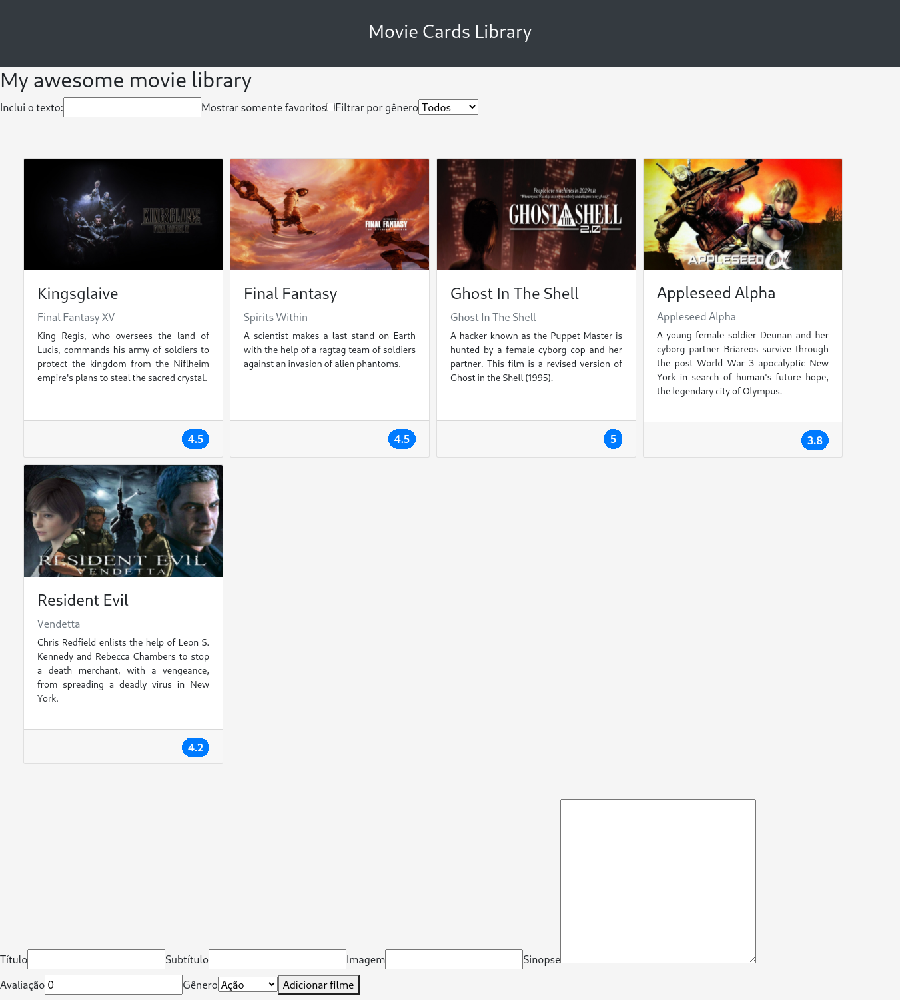

# Trybe Project Movie Cards Library Stateful 09/09/2021
 

  

 

## Habilidades

- Ler o estado de um componente e usá-lo para alterar o que exibimos no browser;
- Inicializar um componente, dando a ele um estado pré-definido;
- Atualizar o estado de um componente;
- Capturar eventos utilizando a sintaxe do React;
- Criar formulários utilizando sintaxe JSX com as tags : input, textarea, select, form;
- Transmitir informações de componentes filhos para componentes pais via callbacks.

## Desenvolvimento
Uma [aplicação](https://weltonthomasferreira.github.io/trybe-project-movie-cards-library-stateful/) que consiste em uma biblioteca de cartões de filmes dinâmica utilizando React.

## Resultados

- `2` dia de projeto;
- `19` requisitos;
- Percentual de cumprimento de requisitos obrigatórios `100.00%`;
- Percentual de cumprimento de requisitos totais `100.00%`.
